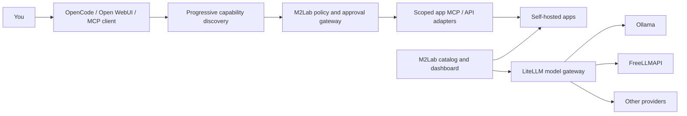

<div align="center">

# M2Lab

### Your private AI app platform

Choose useful open-source apps, run them on your own hardware, and expose the
smallest safe set of capabilities to OpenCode, Open WebUI, or another
MCP-compatible agent harness.

[](LICENSE)
[](https://github.com/dcazes/m2lab/actions/workflows/ci.yml)
[](https://modelcontextprotocol.io/)
[](docs/SETUP.md)

[Why M2Lab](#why-m2lab) · [How it works](#how-it-works) ·
[Quickstart](#quickstart) · [Catalog](#curated-catalog) ·
[Security](#security-model) · [Roadmap](docs/review/07-product-plan.md)

</div>

---

## Why M2Lab

Self-hosting gives you ownership, but assembling a useful stack still means
finding compatible apps, writing Compose files, managing credentials, and
loading dozens of unrelated tool schemas into an AI client.

M2Lab turns that into an outcome-led workspace:

- **Choose a goal:** research, money, travel, wellness, creative work, or local AI.
- **Install deliberately:** see requirements, setup time, dependencies, and data boundaries first.
- **Bring any model path:** local Ollama or provider models routed through LiteLLM; optional adapters can be added later.
- **Use any supported harness:** OpenCode for scoped subagents or Open WebUI for a friendly chat surface.
- **Keep control:** stored secrets are write-only, operational actions need fresh approval, and state changes are audited locally.

The differentiator is not another container grid. It is a curated, governed
capability layer for self-hosted productivity software.

## How it works



The dashboard and CLI share `services.yaml` for deployed-service operations.
`catalog.yaml` describes the user-facing catalog, outcome profiles, deployment
kind, requirements, and progressively discoverable capabilities.

## What is working today

- Registry-driven start, stop, restart, pull, update, health, and backup operations.
- A responsive React dashboard with a resumable initiation flow and a compact daily Workspace: real host metrics, searchable app dock, service health, operations calendar, selected-app commands, recent logs, and configuration forms.
- Secret masking: saved tokens/passwords are never returned to browser clients.
- Short-lived, action-specific lifecycle approvals and a local append-only audit trail.
- Progressive capability matching without injecting the entire tool catalog into an agent context.
- A bearer-authenticated lifecycle MCP server backed by the same service registry.
- LiteLLM → Ollama/provider routing and a curated read-only LiteLLM MCP surface. FreeLLMAPI remains an optional catalog adapter and is not part of initiation.

App-specific cross-app MCP workflows are the next integration layer; catalog
entries describe their intended scopes without pretending unfinished adapters
already exist.

## Quickstart

M2Lab is a host-integrated deployment for Debian 12, Ubuntu 22.04+, and
compatible derivatives. The installer prepares Docker, Python, shared networks,
the production dashboard, and persistent user services. It does not start any
application stacks until you select them in the dashboard.

### Install

```bash
git clone https://github.com/dcazes/m2lab.git
cd m2lab
./install.sh
```

Open `http://127.0.0.1:8787`. The dashboard is local-only by default. Remote
access is intentionally a separate operator choice.

The installer is safe to rerun and never overwrites existing service secrets.
Preview privileged changes with `./install.sh --dry-run`; see all options with
`./install.sh --help`. If Docker was installed for the first time, sign out and
back in once to activate Docker group membership.

For normal use after installation:

```bash
./start.sh
```

See [docs/SETUP.md](docs/SETUP.md) for installation details, troubleshooting,
updates, and verification. Contributors building the dashboard from source
still need Node.js 20+; end users receive the committed production bundle.

The **Initiate** tab then prepares and starts the minimal core in order:
Vaultwarden, LiteLLM, and the self-hosted Firecrawl stack. Generated service
secrets are written directly to mode-`0600` `.env` files and are never returned
to the browser. Nextcloud and SurfSense are offered afterwards as optional
foundations. Progress is resumable and the flow can be run again safely.

Existing app stacks use the shared Docker networks created by the installer.

## Curated catalog

| Outcome | Apps |
|---|---|
| Research | SurfSense, Firecrawl, OpenWhisper, FreeMind |
| Money | Actual Budget, Paperless-ngx, Immich receipt handoff |
| Travel | AdventureLog, SurfSense, Firecrawl, Immich, Paperless-ngx |
| Wellness | Endurain evaluation, AdventureLog |
| Creative | OpenWhisper, Graphite Editor, FreeMind, Immich |
| Local AI | OpenCode, Open WebUI, LiteLLM, FreeLLMAPI, Ollama |

The catalog distinguishes three important shapes:

- **Self-hosted services** are managed through Docker Compose.
- **Local/browser companions** such as Graphite and FreeMind open on the user's device.
- **Infrastructure** such as LiteLLM and Vaultwarden supports the workspace but is not advertised as an agent destination.

Endurain is deliberately marked **evaluation** until its deployment, trademark
conditions, wearable sync, backups, and read-only agent surface complete the
same review as existing services.

## Progressive capability discovery

The top-level harness asks for capabilities using natural task language:

```text
archive selected receipt photos and prepare budget entries
```

M2Lab returns a small shortlist such as document retrieval, selected-asset
export, and transaction drafting. It does not send every underlying tool schema.
Capabilities declare a risk tier:

| Risk | Default behavior |
|---|---|
| Read | Allow |
| Draft | Allow and label as a draft |
| Write / operational | Require explicit approval |
| Destructive | Require typed confirmation |
| Privileged | Deny autonomous use |

## Security model

- Dashboard and app ports bind to loopback; remote access is not enabled by the base installer.
- `.env` files are gitignored, agent containers cannot read them, and browser setup responses never contain stored secret values.
- Lifecycle approvals are short-lived and bound to one service and action.
- Audit records contain event metadata, never secret values or Compose output.
- Recent service logs are bounded and remain inside the dashboard's local access boundary.
- Vaultwarden has no agent or MCP exposure.
- Docker-socket services are treated as root-equivalent and remain read-only or outside agent routing.

Read [SECURITY.md](SECURITY.md) for trust boundaries and vulnerability reporting,
and [docs/review/02-critique.md](docs/review/02-critique.md) for the living hardening backlog.

## Contributing

The easiest high-value contributions are:

- review and improve an app manifest in `catalog.yaml`;
- add a secure service definition following `docs/ADDING_APPS.md`;
- implement a narrow, typed MCP adapter with read-only defaults;
- improve the first-run experience or recovery states;
- verify an app on ARM64 or another supported host configuration.

Start with [CONTRIBUTING.md](CONTRIBUTING.md). CI validates secrets, YAML,
container configuration, Ansible, the dashboard build, and catalog/policy tests.

## Project status

M2Lab is an opinionated alpha built from a running homelab, now being separated
into a reusable product. The live product plan and acceptance criteria are in
[docs/review/07-product-plan.md](docs/review/07-product-plan.md). Honest gaps are
documented rather than hidden behind roadmap checkmarks.

AGPL-3.0-or-later licensed (dual-licensed; commercial license available — see `LICENSE-COMMERCIAL`). Individual catalog apps retain their own licenses and trademarks.
