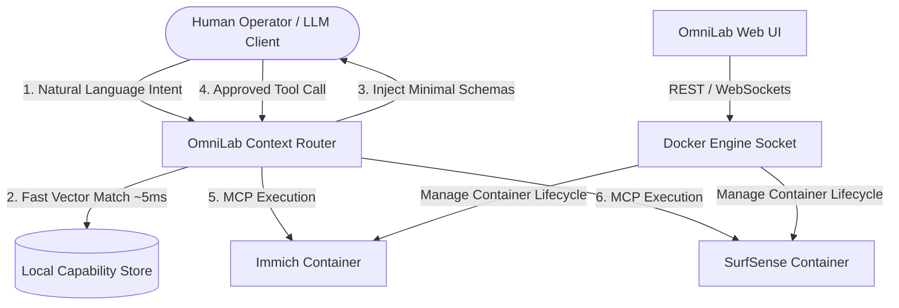

<div align="center">

# ⚡ OmniLab

**AI Discovery Control Plane & Dynamic Context Gateway for Homelabs**

*Empowering human intelligence and decision-making by seamlessly connecting self-hosted applications to local AI agents.*

[](https://opensource.org/licenses/MIT)
[](https://github.com/dcazes/omnilab)
[](https://modelcontextprotocol.io)
[](CONTRIBUTING.md)

[Features](#-key-features) • [Architecture](#-architecture) • [Quickstart](#-quickstart) • [App Catalog](#-supported-app-catalog) • [Roadmap](#-roadmap)

</div>

---

## 💡 The Vision

Most homelab dashboards are built purely for infrastructure administration—they let *you* click "Start" or "Stop" on Docker containers. 

Meanwhile, connecting self-hosted apps (Immich, SurfSense, Mealie) to AI agents usually forces a trade-off: **Tool Schema Overload**. Dumping 100+ raw JSON function schemas into local LLMs burns thousands of context tokens, causes model confusion, and slows down response times.

**OmniLab bridges this gap.** It acts as a dual-layer control plane:
1. **For Humans:** A streamlined UI to manage Docker lifecycles, configure `.env` variables, and view setup guides for specialized self-hosted software.
2. **For AI Agents:** An embedding-based intent router that acts as a **Context Airlock**, surfacing only the 3–5 tools needed for a specific query—preserving your LLM's speed, context window, and accuracy.

---

## 🎯 Designed for Human Augmentation & Discovery

OmniLab puts the human decision-maker back in control:
* **Capability Discovery:** Easily find and deploy local specialized tools (knowledge graphs, photo search, research indexes) to expand your personal knowledge base.
* **Cognitive Noise Reduction:** Eliminates prompt clutter so both human operators and local models remain focused purely on signal.
* **Transparent System Auditability:** Maintain total visual oversight and execution logs over how agents interact with your self-hosted stack.

---

## 📐 Architecture



---

## 🛠️ Quickstart

Deploy OmniLab using Docker Compose:

```yaml
version: '3.8'

services:
  omnilab:
    image: ghcr.io/dcazes/omnilab:latest
    container_name: omnilab
    ports:
      - "3000:3000"
      - "8000:8000"
    volumes:
      - /var/run/docker.sock:/var/run/docker.sock
      - ./data:/app/data
    environment:
      - LOG_LEVEL=info
    restart: unless-stopped
```

Run:
```bash
docker compose up -d
```
Access the dashboard at `http://localhost:3000`.

---

## 📦 Supported App Catalog

| Application | Domain Capability | Container Management | Dynamic MCP Gateway |
| --- | --- | --- | --- |
| **Immich** | Personal Media & Visual Search | ✅ | ✅ |
| **SurfSense** | Web Research & Document Knowledge | ✅ | ✅ |
| **Mealie** | Recipe & Meal Planning | ✅ | ✅ |
| **LiteLLM** | AI Routing & Usage Analytics | ✅ | ✅ |

---

## 🤝 Contributing

Contributions are welcome! Please read our [Contributing Guide](CONTRIBUTING.md) to add new app templates or improve the intent routing engine.
